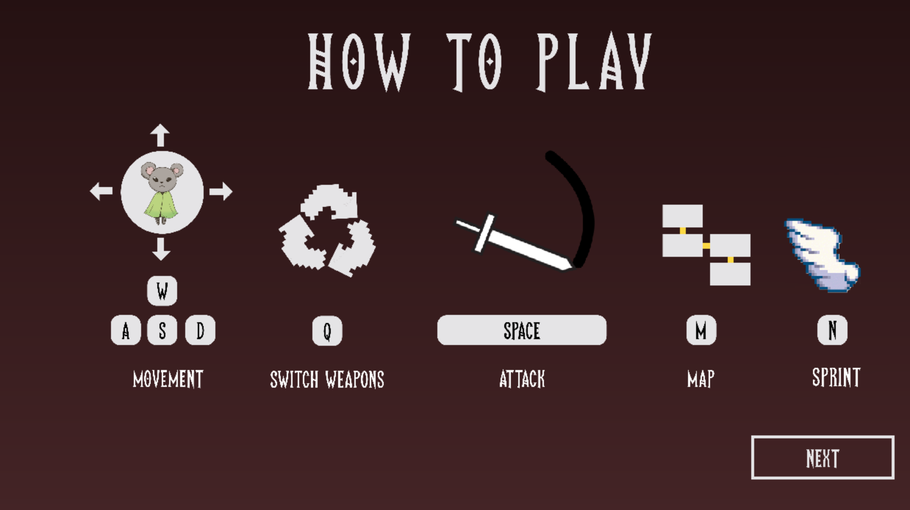
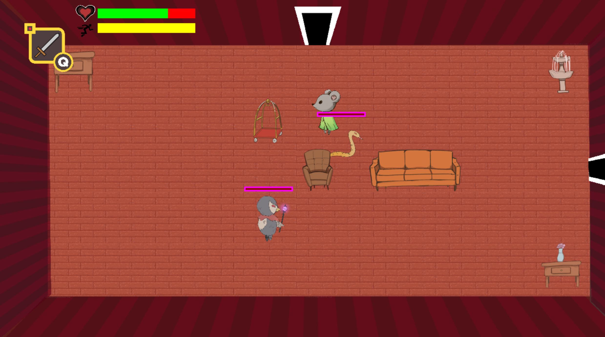
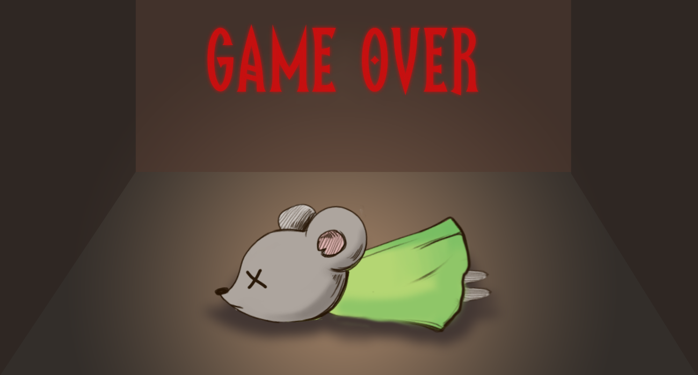

# The Rat Race: The Chosen Cheese
Roguelike Game \
Completed February 2023 \
Project Members: Anthony, Clara, Joey, Harishan, Marco 

## Description

This group project is a roguelike game. Players play as our hero, a rat, trying to get through a enemy-filled hotel in order to reach the Chosen Cheese!
The challenge of the project was to use a grid-based system for the game, which was implemented into the floor generation and obstacle mapping. The game was also practice of Java programming and object oriented programming.

## Installation

In order for the game to be able to choose the solution word, users must have Greenfoot installed. 
Greenfoot can be installed at:
[https://www.greenfoot.org/download](https://www.greenfoot.org/download) 
\
Once installed, open Greenfoot, click Scenario >> open >> choose folder: GameFiles
\
To play the game, click Run. 

## GamePlay 
Game key instructions can be found after the story slides: 
\
 
\
Go through the rooms of the hotel and fight all the enemies!: 
\

\
If you don't make it: \

## Image and Sound Credits: 
Graphics were done by Clara and Anthony. 
Image and sound credits can be found in the starting comments of GameFiles >> "GameWorld.java"

## How to Contribute
Not accepting contributions. 

